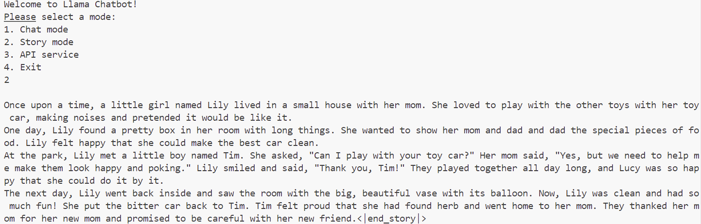
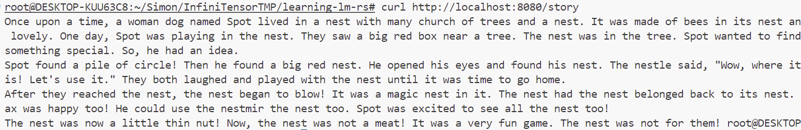
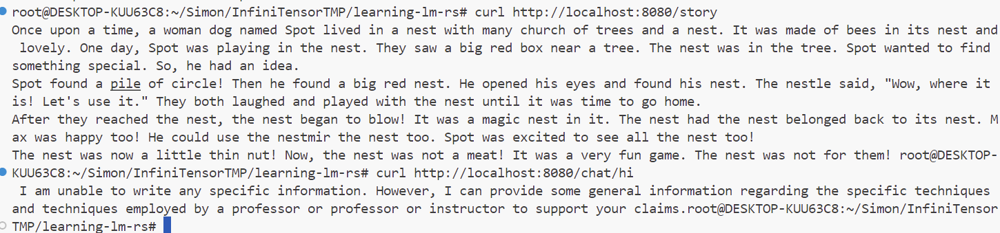

# learning-lm-rs报告

[项目地址]: https://github.com/Simon25772/learning-lm-rs

一，项目概述

在专业内容的基础上完成了混合精度推理，以及网络服务API两项拓展。项目开发及运行环境为WSL2。

二，功能分述

混合精度推理：

思路：使用泛型代码使原始代码支持half库中的f16以及bf16.

网络服务API:

思路: 使用actixweb框架，在APP层面缓存KVCache，使用session技术识别用户。

三，功能展示

1.故事续写

2.AI对话

3.网络服务API

四，有待提高

1.混合精度不支持TF32

2.chat模型的网络服务API等待时间太长

3.功能还可以继续扩展

